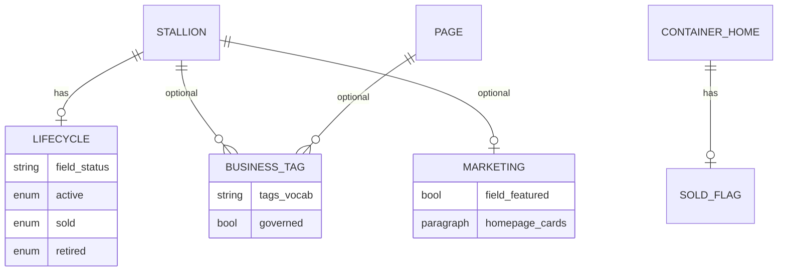

# Classification Domain Model (D11 Target)

**Date:** 2026-05-19  
**Branch:** `feature/legacy-classification-model`  
**Status:** Design phase — **no config changes applied**  
**Prerequisite:** `docs/legacy-classification-audit.md`

---

## Design principles

1. **Single horse entity** — all `wcf_product` legacy sections map to `node:stallion`.
2. **Separate dimensions** — lifecycle, business type, and marketing flags must not share one field.
3. **Governed taxonomy** — tags are editorial labels, not automatic legacy category imports.
4. **Dual discovery preserved** — `/stallions` (SQL) and `/search` (Search API) keep distinct roles.
5. **Intentional reduction** — D11 is smaller and more governed than D7; legacy parity is not a goal.

---

## Domain model overview

---

## 1. Lifecycle status

**Field:** `field_status` on `node:stallion`  
**Storage:** `list_string` — `active`, `sold`, `retired`  
**Config:** `field.storage.node.field_status.yml`

| Value | Meaning | Legacy source |
|-------|---------|---------------|
| `active` | Available / listed | `wcf_product.sold=0` |
| `sold` | Sold — may remain published for archive | `wcf_product.sold=1` |
| `retired` | Withdrawn without sold semantics | No D7 column — editorial only |

**Rules:**

- Lifecycle is **not** taxonomy. Do not create a “Sold” term.
- Default listing queries should prefer `active` unless the View explicitly includes sold (archive display).
- `container_home` uses `field_sold` (boolean) — **known inconsistency**; do not merge into `field_status` without a dedicated cross-bundle migration.

**Discovery exposure:**

| Surface | Mechanism |
|---------|-----------|
| `/stallions` | Exposed filter `stallion_status` (SQL) |
| `/search` | Facet `stallion_status` (Search API field `status`) |

**Migration (current):** `wcf_d7_node_stallion.yml` maps `sold` 0/1 → `active`/`sold`. `retired` is never set by migrate.

---

## 2. Business type (section / inventory class)

Legacy `wcf_category` rows represented **listing sections**, not Drupal taxonomy. In D11 these are **business-type labels** applied to the same `stallion` bundle.

### Options evaluated

| Approach | Verdict | Notes |
|----------|---------|-------|
| Separate bundles (`foal`, `broodmare`, …) | **Rejected** | Breaks single index; duplicates fields |
| Controlled vocabulary `horse_section` | **Deferred** | Valid if governance approved; prefer reusing `tags` with allow-list |
| Governed `tags` terms | **Preferred (when approved)** | Reuse existing `field_tags` + facet; cap at &lt;20 terms |
| Computed discovery mapping | **Future** | View contextual filters from migration lookup table — only if tags rejected |

### Proposed controlled labels (not yet imported)

| Legacy `wcf_category` | Proposed label | Facet on `/search`? |
|-----------------------|----------------|---------------------|
| Foals | `Foals` | Yes, after governance |
| Broodmares | `Broodmares` | Yes |
| ASB Stallions | `ASB` | Yes |
| Stallions | — | **Reject** — redundant with bundle |
| For Sale | — | **Reject** — use `field_status=active` |
| show mares | `Show mares` | Optional (2 legacy rows) |

### Foal year (secondary dimension)

| Field | Status |
|-------|--------|
| `field_year` (integer or list) | **Deferred** — 128 foals depend on D7 `year` column |

If implemented: expose on `/stallions` as exposed filter only; **do not** add to Search API until index field and editorial rules exist.

---

## 3. Marketing / promotion flags

**Do not overload taxonomy for marketing concepts.**

| Concept | D11 mechanism | Legacy source |
|---------|---------------|---------------|
| Featured on listings | `field_featured` (boolean) | `wcf_featured_horse`, `new_launch`, `best_seller` (unused) |
| Homepage showcase cards | `homepage` + `feature_card` / `featured_stallions` paragraphs | `wcf_showcase` (6 rows) |
| Homepage ASB strip | Paragraph curation or `field_featured` | D7 homepage SQL on `asb_stallions` |

**Rules:**

- `field_featured` is editorial — not migrated from D7 (defaults to 0).
- Showcase is **not** a horse category; do not tag stallions “Showcase” unless editorial convention explicitly requires it.
- Cap featured blocks at configured paragraph limits (`field_featured_count`).

---

## 4. Discovery facets

### What belongs in public facets (`/search`)

| Facet | Field | Include? |
|-------|-------|----------|
| Status | `field_status` → index `status` | **Yes** — lifecycle discovery |
| Content type | bundle | **Yes** — cross-bundle search |
| Tags | `field_tags` | **Yes when populated** — hidden when empty (current state) |

### What should remain editorial-only

| Concept | Reason |
|---------|--------|
| `field_featured` | Marketing; sort key on `/stallions`, not a public filter |
| Homepage paragraph selection | Curated; not facet-able |
| Moderation state | Admin/workflow only |
| Per-horse canonical path | URL governance, not discovery |

### What should NOT become public filters

| Concept | Reason |
|---------|--------|
| Raw legacy `category_id` | No D11 field; would need rebuild |
| “For Sale” as facet | Conflicts with status semantics |
| Unlimited auto-created tags | `auto_create: true` risks facet explosion |
| ASB + Sold + Stallions as three facets | Redundant with status + optional single “section” tag |

### Facet scale policy

Reference: `docs/taxonomy-scale-readiness.md`

- Keep tag vocabulary **&lt;25 terms** before promoting tags facet visibility.
- Run `search-api:reset-tracker` after bulk tag operations.

---

## 5. Non-horse business lines

| Legacy | D11 bundle | Classification model |
|--------|------------|----------------------|
| Compliant Container Homes | `container_home` | Separate bundle; `field_sold` for lifecycle |
| Agistment | `page` | Editorial page — no horse fields |
| News | `article` | Editorial; optional `field_tags` |
| Homepage marketing | `homepage` | Paragraph composition |

**Do not** classify container homes as stallions or tag them with horse section labels.

---

## 6. Implementation roadmap (gated)

| Step | Action | Gate |
|------|--------|------|
| 1 | Product-owner resolves For Sale / `sold` anomaly | Business sign-off |
| 2 | Editorial workshop: approved tag list (≤20) | Governance doc signed |
| 3 | One-time migration plugin: `category_id` → `field_tags` | Step 2 + synonym table |
| 4 | Optional `field_year` + View exposed filter | Step 1 if foal year-nav required |
| 5 | Re-index + facet QA | After any field population |

**Current phase:** Steps 1–5 are **not authorized**. Architecture is documented only.

---

## 7. Field responsibility matrix

| Concern | Authoritative field | Never use |
|---------|---------------------|-----------|
| Is it sold? | `field_status` | Tag “Sold”, category |
| Is it a foal/broodmare/ASB? | Governed `field_tags` (future) | Separate bundle |
| Is it highlighted? | `field_featured` | Taxonomy |
| Is it on homepage hero? | Homepage paragraphs | View filter |
| Container sold? | `field_sold` on `container_home` | `field_status` (until unified) |
| Cross-bundle search | Search API index | Parallel SQL index |

---

## 8. Architecture decisions log

| Decision | Outcome | Date |
|----------|---------|------|
| Single `stallion` bundle | **Accepted** (existing) | Platform baseline |
| `field_status` for lifecycle | **Accepted** (existing) | Migration shipped |
| Bulk `wcf_category` → tags | **Rejected** | 2026-05-19 |
| New `horse_section` vocabulary | **Rejected** | 2026-05-19 |
| `field_year` for foals | **Deferred** | 2026-05-19 |
| ASB dedicated View | **Rejected** | 2026-05-19 |
| Tag facet promotion | **Deferred** until ≥1 governed term on stallions | 2026-05-19 |
